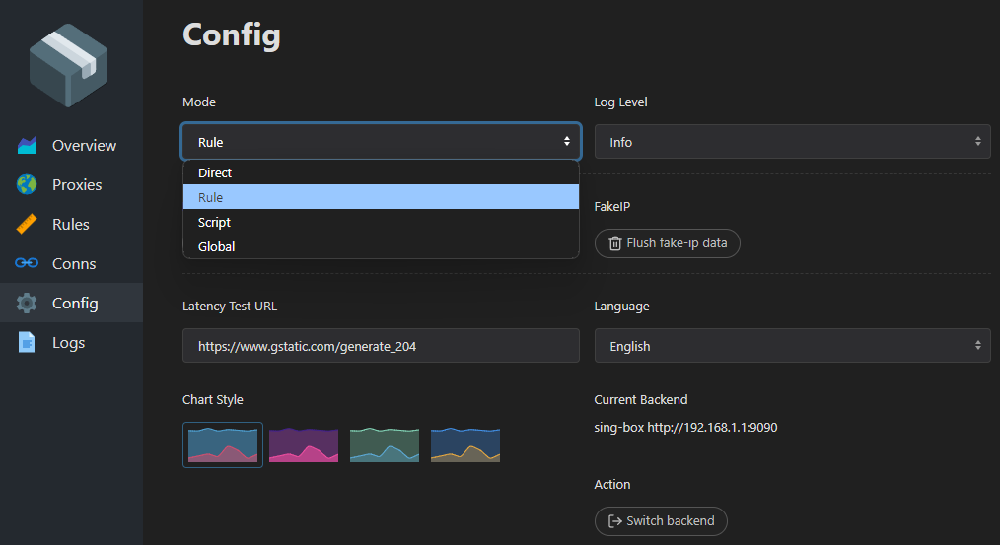

<h2 align="center">OpenWrt + sing-box + FakeIP</h2>

Если вы ищете альтернативу точечной маршрутизации на уровне `dnsmasq`, рассмотрите использование маршрутизации с использованием `FakeIP`, входящего в состав `sing-box`.

> [!NOTE]
> Некоторые моменты примера заимствованы из статьи [Настройка sing-box и tun2socks](https://itdog.info/podnimaem-na-openwrt-klient-proksi-vless-shadowsocks-shadowsocks2022-nastrojka-sing-box-i-tun2socks) от `ITDog` и приведены здесь исключительно в целях более полного понимания

### Применяемое оборудование и версии ПО
- Оборудование: Xiaomi AX3000T
- Операционная система: OpenWrt 23.05.4

### Установка
Обновляем списки пакетов из репозиториев
```shell
opkg update
```
Устанавливаем sing-box
```shell
opkg install sing-box
```
Устанавливаем curl
```shell
opkg install curl
```
Устанавливаем текстовый редактор (опционально, можете использовать тот, который кажется вам удобнее)
```shell
opkg install nano
```

### Настройка sing-box
Включаем sing-box и настраиваем запуск от пользователя `root`
```shell
nano /etc/config/sing-box
```
```text
config sing-box 'main'
	option enabled '1'
	option user 'root'
	option conffile '/etc/sing-box/config.json'
	option workdir '/usr/share/sing-box'
```

Редактируем файл конфигурации `sing-box`. 
```shell
nano /etc/sing-box/config.json
```
Полностью готовый файл конфигурации с подключением к VLESS-Reality можно позаимствовать из [openwrt-sing-box-fakeip.json](configs/openwrt-sing-box-fakeip.json), который проксирует домены `youtube`, а также `ifconfig.me` для проверки работоспособности маршрутизации
> [!IMPORTANT]
> Не забудьте изменить следующие конфиденциальные данные подключения к вашему серверу VLESS-Reality:
> - `%server_address%`
> - `%vless_uuid%`
> - `%SNI%`
> - `%uTLS%`
> - `%public_key%`
> - `%short_id%`

> [!WARNING]
> Приведенный в качестве примера конфигурационный файл проксирует только домены youtube и домен ifconfig.me!
> 
> Если вам необходимо добавить свои домены для проксирования, следует ознакомиться с [документацией конфигурирования правил DNS](https://sing-box.sagernet.org/configuration/dns/rule/)

Добавляем `zone` и `forwading` в firewall 
```shell
nano /etc/config/firewall
```
```text
config zone
        option name 'tun'
        option forward 'ACCEPT'
        option output 'ACCEPT'
        option input 'ACCEPT'
        option masq '1'
        option mtu_fix '1'
        option device 'tun0'
        option family 'ipv4'

config forwarding
        option name 'lan-tun'
        option dest 'tun'
        option src 'lan'
        option family 'ipv4'
```
Перезапускаем `firewall` и `sing-box`
```shell
service firewall restart
service sing-box start
```
Проверяем работоспособность, отправив запрос на `ifconfig.me` через интерфейс `tun0`
```shell
curl --interface tun0 ifconfig.me
```
Если запрос вернул IP адрес VPS, значит настройка `sing-box` завершена

### Настройка маршрутизации 
Работоспособность `sing-box FakeIP` обеспечивается использованием `sing-box` в качестве DNS-сервера. Для этих целей в секции `inbounds` открыт 5353 порт для входящих dns-запросов
```json
{
    "type": "direct",
    "tag": "dns-in",
    "listen": "127.0.0.1",
    "listen_port": 5353,
    "sniff": true
}
```
Отключаем использование DNS-серверов, предоставляемых провайдером установив значение параметру `peerdns` равное `0` для `wan` интерфейса
```shell
nano /etc/config/network
```
```text
config interface 'wan'
        ...
        # Disable DNS servers advertised by peer
        option peerdns '0'

```
> [!TIP]
> Аналогичное действие можно выполнить в веб-интерфейсе luci, сняв галочку `Use DNS servers advertised by peer` в `Network -> Interfaces -> WAN -> Edit -> Advanced Settings`

Редактируем конфигурацию `dnsmasq`, указывая `sing-box` в качестве DNS-сервера
```shell
nano /etc/config/dhcp
```
```text
config dnsmasq
  ...
  # Sing-box DNS
  list server '127.0.0.1#5353'
```
Создаем скрипт, который при запуске/рестарте сети создаст маршрут, отправляющий сеть `FakeIP` в интерфейс `tun0`
```shell
nano /etc/hotplug.d/iface/30-vpnroute
```
```shell
#!/bin/sh

sleep 5
ip route add 198.18.0.0/15 dev tun0
```
Перезапускаем сеть
```shell
service network restart
```
> [!WARNING]
> Клиенты сети должны использовать роутер в качестве DNS-сервера, а также не использовать DoH/DoT, иначе `FakeIP` не будет работать

> [!NOTE]
> На этом настройка завершена. Если вам не интересны детали работы или дополнительные функции переключения режимов маршрутизации, то дальнейшее чтение не обязательно 

### Принцип работы
Служба `FakeIP` сконфигурирована таким образом, чтобы использоваться в качестве forwarding dns-сервера и отдавать фейковые адреса из сети `198.18.0.0/15` для `IPv4` и `fc00::/18` для `IPv6`
```json
{
    "dns": {
        "servers": [
            {
                "tag": "fakeip-server",
                "address": "fakeip"
            }
        ],
        "fakeip": {
            "enabled": true,
            "inet4_range": "198.18.0.0/15",
            "inet6_range": "fc00::/18"
        }
    }
}
```
> [!WARNING] 
> Под капотом `FakeIP` также создает `"fakeip context"` что при некорректной настройке может приводить к ошибкам вида
>
> inbound/tun[tun-in]: missing fakeip context
> 
> Однако официальная документация не раскрывает деталей этой реализации

В связи с тем, что нам необходимо получать фейковые адреса только для определенных доменов, нам потребуется правило в ключе `rules` конфигурации `dns`
```json
{
    "query_type": [
        "A",
        "AAAA"
    ],
    "domain_suffix": [
        "ifconfig.me"
    ],
    "rule_set": [
        "youtube"
    ],
    "server": "fakeip-server"
}
```
Из этого правила видно, что для резолвинга домена `ifconfig.me`, а также списка доменов `youtube` будет использоваться сервер `fakeip-server`, который в свою очередь вернет фейковый адрес из сети `198.18.0.0/15`.

Так как ранее мы настроили маршрут, отправляющий сеть `198.18.0.0/15` в интерфейс `tun0`, не составляет труда настроить правило маршрутизации `sing-box`, отправляющее всё, что приходит на интерфейс `tun0` через наш сервер VLESS-Reality
```json
{
    "inbound": [
        "tun-in"
    ],
    "outbound": "vless-out"
}
```

### Дополнительный функционал Chash API: Clash Mode


В экспериментальных настройках  `sing-box` существует возможность включения `Clash API` с графическим интерфейсом, в разделе конфигурации которого возможет выбора режима:
- Direct
- Rule
- Global

В конфигурационном файле [openwrt-sing-box-fakeip-clash-api.json](/configs/openwrt-sing-box-fakeip-clash-api.json) `Clash API` настроен и доступен по адресу http://192.168.1.1:9090/ui/

Подробнее о настроенных режимах:

- Режим `Direct` предназначен для маршрутизации всего трафика через провайдера, минуя `VLESS-Reality`. `FakeIP` не включен в работу резорвинга доменов.
- Режим `Rule` предназначен для точечной маршрутизации по доменам. `FakeIP` включается в работу и подменяет адреса тех доменов, которые указаны в правилах `DNS`. 
- Режим `Global` предназначен для маршрутизации всего трафика через `VLESS-Reality`. `FakeIP` включается в работу и подменяет адреса всех доменов, что заставляет `OpenWrt` отправлять весь трафик в `tun0`.

> [!WARNING]
> К сожалению, пока не удалось добиться мягкого переключения маршрутизации уже установленных соединений, поэтому после изменения режима проксирования следует выполнить перезапуск службы `sing-box` и `network` 
> ```shell
> service sing-box restart
> service network restart
> ```